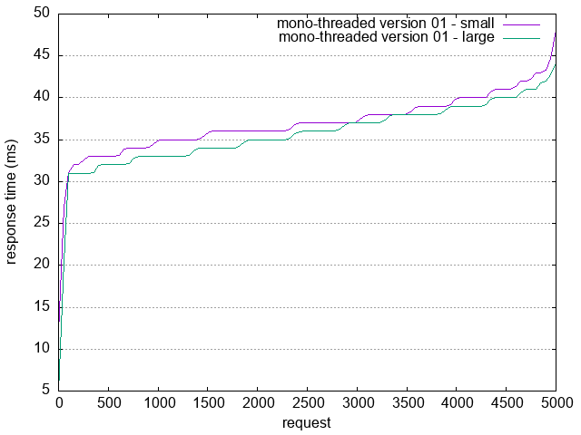

# rust-web

A very simple HTTP server in rust - target: small footprint, static html, work on old or small computer 

## Goals of this web server

* [ ] Very small footprint
* [ ] Works on Raspberry Pi devices
* [ ] Serve static files HTML/TXT/JSON/XML...
* [ ] Smallest CO2 impact - no environmental footprint - should works with super low energy on a rasb-pi zero for instance
* [ ] It's own CDN with is own in RAM Memory Cache
* [ ] Provide a generic Manifest to ensure low consumtion of the server

## Test and measurment

To ensure performance test are run since the start of the project

We test against a small "hello world" html page of 175 bytes and a big "hello the universe" html page of 1178104 bytes

### Process Description

For each version we run and compute the test result here is an example for version 01

**in the httpd folder**
```shell
cargo run -- mono v01
```

**in the root folder**

```shell
ab -n 5000 -c 100 -g doc/v01-hello-world.tsv http://127.0.0.1:7878/hello-world.html
ab -n 5000 -c 100 -g doc/v01-hello-universe.tsv http://127.0.0.1:7878/hello-universe.html
gnuplot scripts/ab-plot.p
```



Then every test will be compiled in markdow file such as doc/test-mono-v01.md for instance.

In all the case 2 files are tested: *hello-world.html* (175 bytes) and *hello-universe.html* (1178104 bytes)

And the graph is computed comparing those 2 files ab response.

### List of test

|type|version|description|detail|
|----|-------|-----------|------|
|mono|v01| simple basic mono thread with a read file each time|[result-test-mono-v01.md](doc/result-test-mono-v01.md)|
|mono|v02| simple basic mono thread with a read file once|[result-test-mono-v02.md](doc/result-test-mono-v02.md)|
## Source
Based on:
* [Final Project: Building a Multithreaded Web Server](https://doc.rust-lang.org/book/ch20-00-final-project-a-web-server.html) 
* [MDN Manifest](https://developer.mozilla.org/en-US/docs/Web/Manifest)
* [Rust HTTP 3](https://docs.rs/quiche/latest/quiche/h3/index.html)
* 
