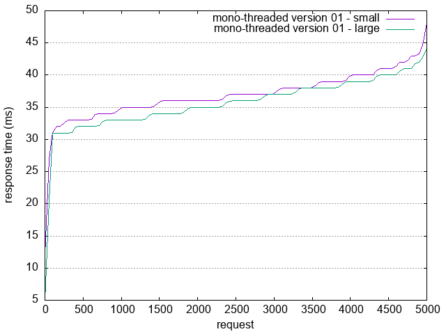

# Test Mono v01

A simple mono threaded, process using TcpListener binding

```Rust
let listener = TcpListener::bind("127.0.0.1:7878").unwrap();
for stream in listener.incoming() {
  monothreaded::v01::handle_connection(stream);
}
```

Each time handle_connection receive a stream, it reads the request and then reads a file (IO access) then streams it.

## Run the test

**in the httpd folder**
```shell
cargo run -- mono v01
```

**in the root folder**

```shell
ab -n 5000 -c 100 -g doc/v01-hello-world.tsv http://127.0.0.1:7878/hello-world.html
ab -n 5000 -c 100 -g doc/v01-hello-universe.tsv http://127.0.0.1:7878/hello-universe.html
gnuplot scripts/ab-plot-v01.p
```

## Test results

### Apache Benchmark results

#### Hello world

|Ab informations|Test result|
|---------------|-----------|
|Server Software:       | Opendojo-rust-web-mono-v01/0.1.0|
|Server Hostname:       | 127.0.0.1|
|Server Port:           | 7878 |
|| |
|Document Path:         | /hello-world.html|
|Document Length:       | 213 bytes
|| |
|Concurrency Level:     | 100 |
|Time taken for tests:  | 1.873 seconds|
|Complete requests:     | 5000|
|Failed requests:       | 0|
|Non-2xx responses:     | 5000|
|Total transferred:     | 1635000 bytes|
|HTML transferred:      | 1065000 bytes|
|Requests per second:   | 2669.18 [#/sec] (mean)|
|Time per request:      | 37.465 [ms] (mean)|
|Time per request:      | 0.375 [ms] (mean, across all concurrent requests)|
|Transfer rate:         | 852.36 [Kbytes/sec] received |





